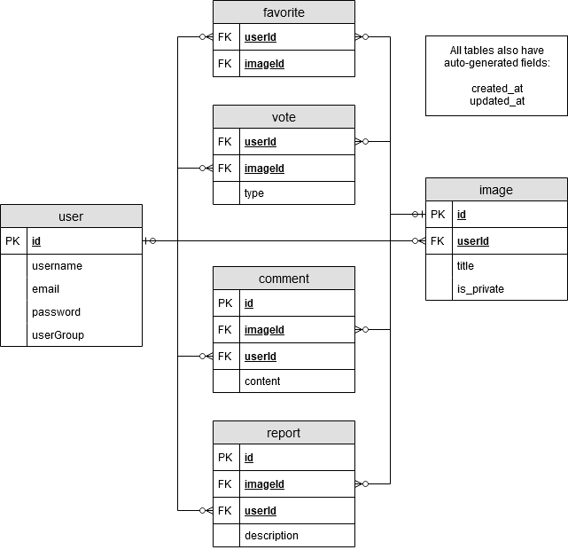

# Image sharing service REST API

### Mikko Martikainen

This repository contains the following parts:

* API documentation
* Report
* Source code

[Link to the assigment](http://ttow0130.pages.labranet.jamk.fi/Assignments/API-coding/)

# Features

### Core API functionality

|Feature|status|
|-------|:------:|
|Ability to upload a new image | OK |
|Ability to list uploaded images | OK |
|Ability to remove an uploaded image | OK |
|Ability to vote (upvote, downvote) an image | OK |
|Ability to mark image as a favorite or remove it | OK |
|Ability to comment on a image | OK |
|Ability to edit or remove comments | OK |

### Advanced API functionality

|Feature|status|
|-------|:------:|
|Ability to create a user / register | OK |
|Ability to login and logout | OK |

### Extra credits

|Feature|status|
|-------|:------:|
|Multiple user levels (admin, normal user, anonymous) | OK |
|Public (shows up in recent uploads) and private (only visible to self) gallery | OK |
|Report this image feature | OK |

### Special requirements

|Feature|status|
|-------|:------:|
|Creating a docker-compose.yaml file with the appropriate environment | OK |

# Installation

This rest-api also requires [Infra](https://gitlab.labranet.jamk.fi/ttow0130/infra) to function properly.

Clone the repository and create .env file from .env.example with appropriate values. 

Build docker image and and start the services.

```
$ docker-compose build
$ docker-compose up

// or in detached mode 
$ docker-compose up -d
```

# Database

## Database description

Image files are stored in minio block-storage, data in postgreSql database.



# API Documentation

## Usergroups

Usergroups are used to control the usage of API features. Valid usergroups are: 

```
    0: Admin
    1: Normal user
    (2: Anonymous)
```

Resource URIs

```
/users
/users/login
/users/logout
/users/favorites
/users/favorites/{id}
/users/private

/images
/images/{id}
/images/{id}/votes
/images/{id}/comments
/images/{id}/reports

/comments/{id}

/reports
```


# Users


* Create a new user to the database if the given email is not already in use. Usergroup always defaults to normal user.

```
POST /users

Parameters: { username, password, email, userGroup }

Response: { success }
```


## Login


* Authenticate the user and creates a session on the server. 

```
POST /users/login

Parameters as basic-auth: { email, password }

Response: { userId, name, email, userGroup }
```


## logout


* Destroy the session on the server if it exists.

```
POST /users/logout

Response: { success }
```


## Favorites


* Get user favorite images

```
GET /users/favorites

Parameters: { }

Response: { [ image ] }
```

* Add image to user favorites

```
POST /users/favorites

Parameters: { imageId }

Response: { success }
```

* Remove image from user favorites

```
DELETE /users/favorites/{id}

Response: { success }
```


## Private 


* Get user private images

```
GET /users/private

Response: { [ image ] }
```


# Images


* Upload new image to the service. Requires an active user session.

```
POST /images

Parameters: { title, isPrivate, image (type: file) }

Response: { success }
```

* Return all images, excluding private images.

```
GET /images

Response: { [ image ] }
```

* Return specific image.

```
GET /images/{id}

Response: { image (type: file) }
```

* Delete specific image.

```
DELETE /images/{id}

Response: { success }
```


## Comments


* Get all comments of specific image

```
GET /images/{id}/comments

Response: { [ Comment ] }
```

* Add a comment to image.

```
POST /images/{id}/comments

Parameters: { content }

Response: { success }
```


## Votes

* Get votes by image.

```
GET /images/{id}/votes

Response: { [ Vote ] }
```

* Add vote or update database entry if it already exists.

```
POST /images/{id}/votes

Parameters: { type ('upvote' OR 'downvote') }

Response: { success }
```

## reports

* Get reports of a image. Requires admin userGroup.

```
GET /images/{id}/reports

Response: { [ Report ] }
```

* Add a report to image.

```
POST /images/{id}/reports

Parameters: { description }

Response: { success }
```


# Comments

Only the uploader of comment can do the following actions.

* Edit comment

```
PUT /comments/{id}

Parameters: { content }

Response: { success }
```

* Remove comment from image 

```
Delete /comments/{id}

Response: { success }
```

# Reports

* Return all reports in database. Requires admin userGroup.

```
GET /reports

Response: { [ Report ] }

```

# Test Routes

* Test backend is up

```
GET /test

Response: { message }

```

* Return active session data

```
GET /session

Response: { userId, name, email, userGroup }

```

# Depencies

* Express 
* Express-fileupload
* Express-session
* express-validator
* basic-auth
* Bcrypt
* Sequalize
* minio
* pg
* pg-hstore
* pino
* pino-pretty
* cors
* command-line-args

# Notes 

## CSC Services

* cPouta instance must be "medium"-size (4gb of memory), small runs out of memory and services crash.
* To access services via browser, http- and tcp-traffic must be allowed in security group rules.
* Establishing shh-connection with virtual machine also requires the user account name, which [depends on the image used](https://docs.csc.fi/cloud/pouta/connecting-to-vm/), to gain access.
